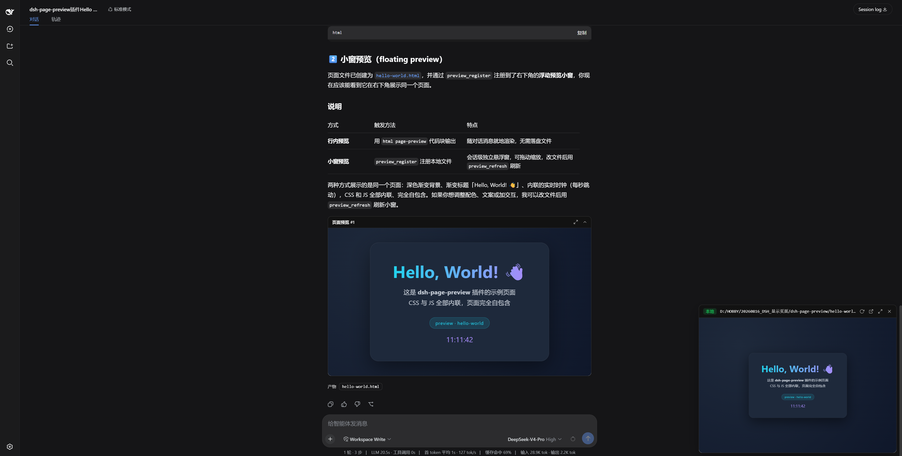

<div align="center">

# dsh-page-preview

**让 DeepSeek Harness 直接在网页里把页面「显示」给你看**

[](LICENSE)
[](https://github.com/watericetangcw/dsh-page-preview)

**[English](README.en.md) · 简体中文**



</div>

一次安装，永久可用：既能把模型生成的 HTML 代码块**行内渲染**成可交互预览，也能用右下角**浮动小窗**实时预览任意本地页面或网址。

## ✨ 功能亮点

### 🖥️ 行内预览

让 DSH 输出一个 `html page-preview` 代码块，答案发完后，它就会变成消息下方的一个**可交互预览面板**——全屏、收起、在新窗口打开，样样都行，而代码块本身依然是普通代码块。

### 🪟 浮动小窗

四个工具，随时预览：

| 工具 | 作用 |
| --- | --- |
| `preview_register` | 注册并打开预览：本地 HTML 文件、含 `index.html` 的目录，或 http(s) 网址 |
| `preview_replace` | 换一个页面继续预览 |
| `preview_refresh` | 改完文件后一键刷新 |
| `preview_unregister` | 解除注册并关闭 |

小窗可拖动、可缩放、可全屏；内容按虚拟桌面宽度等比缩放，小窗也不会把页面挤扁。关闭小窗时会「飞」向右上角，化成一枚带绿色呼吸灯的胶囊，点一下即恢复。预览按会话隔离，切换会话互不打扰。

## 🚀 快速安装

一条命令即可：

```powershell
dsh plugin --profile web add github:watericetangcw/dsh-page-preview
```

安装完成后重启 `dsh web`，并刷新一次浏览器页面，即可使用。

## 🧪 快速体验

复制下面的提示词发给 DSH，立刻看到效果：

**① 行内预览——生成并展示一个页面**

```
请编写一个完整的静态 HTML 页面（CSS 与 JS 全部内联），用 `html page-preview` 代码块展示出来，内容是一个实时时钟卡片。
```

**② 浮动小窗——预览一个在线页面**

```
请用 preview_register 预览这个网页：https://watericetangcw.github.io/dsh-page-preview/hello-world
```

**③ 浮动小窗——预览本地工程并刷新**

```
请用 preview_register 预览 docs/demo-site 目录，然后把页面标题改成「dsh-page-preview 演示」，再调用 preview_refresh 让我看到更新。
```

## 📖 使用方式

- **行内预览**：让 DSH 输出 ` ```html page-preview ... ``` `（CSS 与 JS 需全部内联）。
- **浮动小窗**：直接调用 `preview_register` 传入路径或网址即可，其余三个工具用于替换、刷新与关闭。

## 🔗 链接

- 仓库：[github.com/watericetangcw/dsh-page-preview](https://github.com/watericetangcw/dsh-page-preview)
- 在线演示：[Hello World](https://watericetangcw.github.io/dsh-page-preview/hello-world) · [demo-site](https://watericetangcw.github.io/dsh-page-preview/demo-site/)

## 📄 许可证

[MIT](LICENSE) © 2026 WateRice
